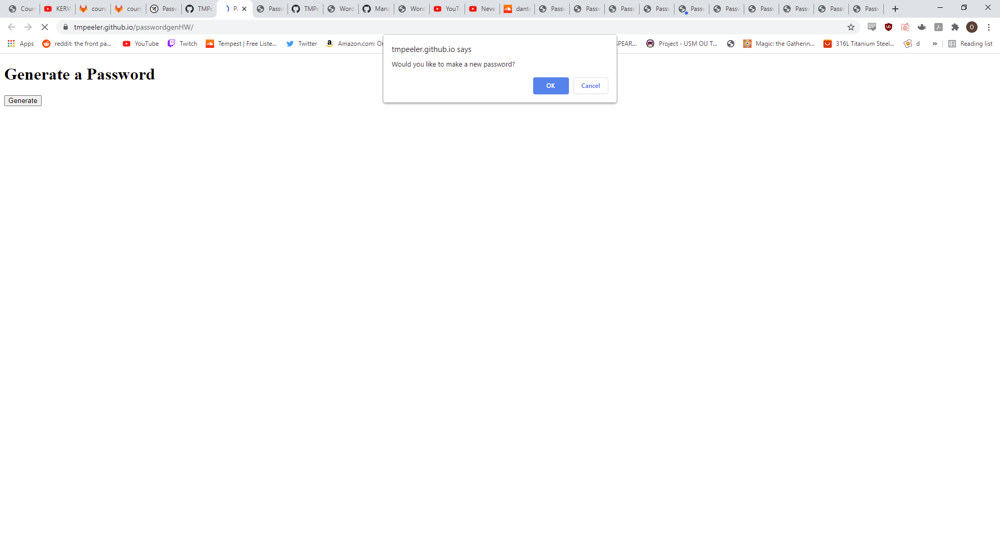

# passwordgenHW

The purpose 

## Getting Started

I started a fresh repo and started generating all my files, then I started pseudocoding and taking notes about what functions and steps I needed to take in order to solve the problem.

### Prerequisites

In order to accomplish the goal of this assignment, I had to use VSCode for the HTML but particularly JavaScript as well as Gitbash for moving files between my repository and local machine. I also used Github to create the repository that I was sending to. 

### Solving

This was the hardest thing I've had to do in this class so far, solving the problem has actually made me socialize a lot so that I could gain understandings for different parts of the assignment. First I had to assign the variables of multiple arrays. Then I had to collect boolean variables for each array type i wanted to access. Based on that boolean I checked it would return a concatted string that I then displayed on the screen.

## Technologies Used

* [HTML](https://developer.mozilla.org/en-US/docs/Web/HTML)
* [JS](https://www.javascript.com/)

## Deployed Link

* [https://tmpeeler.github.io/passwordgenHW/](#)

## Code snippet of important work:

var lowerCaseChoice = window.confirm("Would you like to include lowercase characters in your password?");
    var upperCaseChoice = window.confirm("Would you like to include uppercase characters in your password?");
    var numbersChoice = window.confirm("Would you like to include numbers in your password?");
    var specialChoice = window.confirm("Would you like to include special characters in your password");
    if (lowerCaseChoice || upperCaseChoice || numbersChoice || specialChoice) {
    } else {
        window.alert("Please include at least one character type");
        return;
    }
    ^^^^^^ used to gather user input and store as boolean but very efficiently

## Picture of website currently deployed

;

## Authors

* **Thomas Peeler** 

- [https://github.com/TMPeeler/passwordgenHW]

## Acknowledgments

* Special thanks to Marko and Mark for helping me debug and come up with ways to use my tools to solve the big problems and restrictions of this as well as Javier, Jake, and Liam for telling me about their understanding and strategies of attack that helped me understand what was necessary to solve the problem.